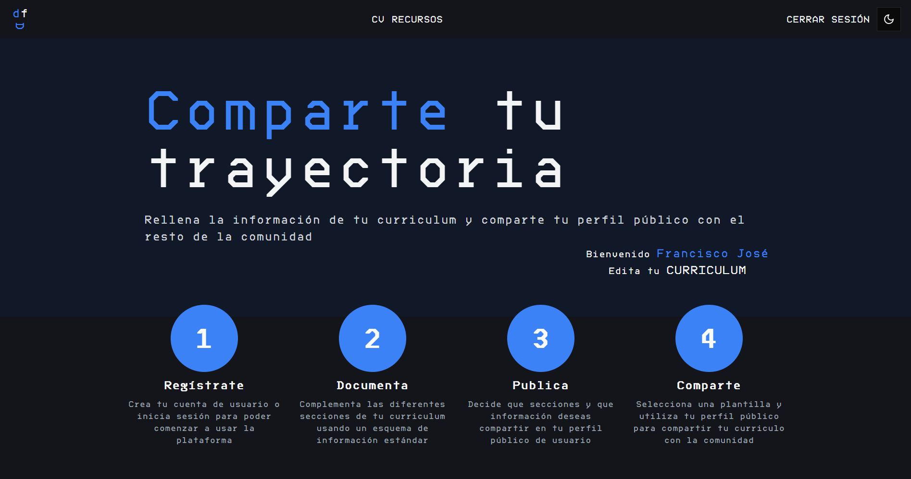
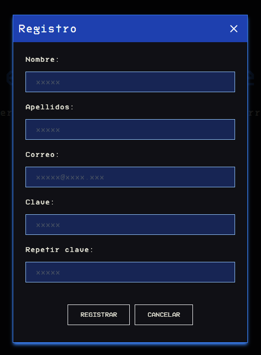
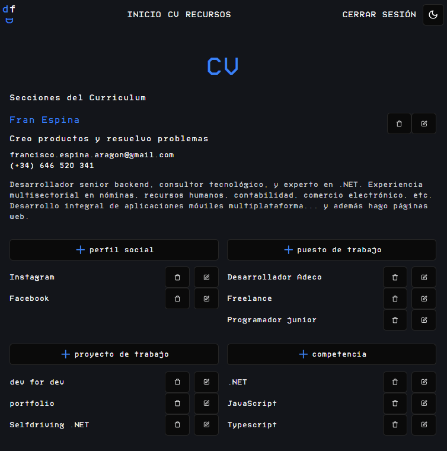
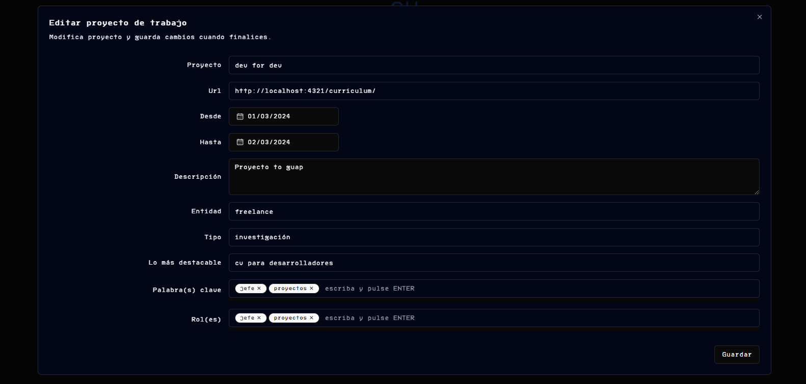
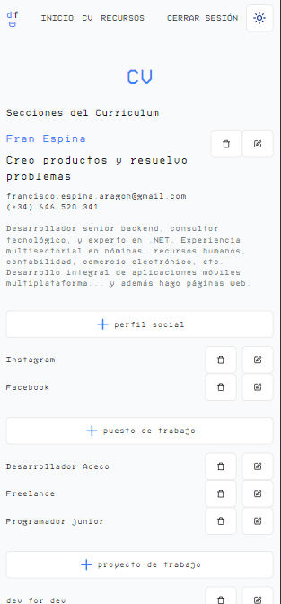

# dev profile for dev [Work in progress]
## Funcionalidad
Web que permite a los usuario logarse y crear una cuenta de desarrollador donde poder mantener aspectos relacionados con el desarrollo: 
 - Enlaces a recursos / tips / imágenes

## Detalles técnicos
- Web realizada en Astro y con algún componente React. Estilada con tailwindCSS. Typescript.
- Backend realizado con express y contra un postgresql. Typescript.
- Gestión de autentificación y autorización con jwt tokens
- Modelos de formularios (frontend) y base de datos (backend) validados con zod.
- Validación de esquemas zod con tipos genéricos (servicio de validación de esquemas)

# Capturas
## Gestión de usuarios

## Registro de CV por usuarios

## Formularios modales

## Modo claro y responsive

# TODO
- [ ] Validaciones de tamaños máximos en zod
- [x] Las validaciones deberían estar al perder el foco los campos del formulario no sólo al grabar
- [x] Validaciones de fecha inicio y fin pendientes en algunos esquemas
- [x] FIX: al eliminar el último elemento de una sección lo borra en bd pero sigue en pantalla
- [x] Cambiar todas las secciones para que compartan el formulario de Edición y creación como se hizo posteriormente con las nuevas
- [ ] Revisar el scroll de los modales cunando la sección no entra verticalmente 
- [ ] Poder decidir si tu cv se puede ver públicamente
- [x] Poder indicar que campos se ven públicamente y cuales son privados
- [ ] Poder order dentro de las secciones
- [x] Crear vista pública del cv
- [x] Incluir todas las secciones del cv
- [x] Poder seleccionar la plantilla pública del cv (varios templates)
- [ ] Tener una validación de los campos / secciones que son obligatorios para poder usar una plantilla
- [ ] Revisar que la(s) plantilla(s) no da(n) un error no controlado cuando le(s) falta un campo
- [ ] Permitir importar las secciones del cv según el esquema
- [x] Permitir exportar el cv a formato json segun el esquema
- [x] FIX. Revisar el esquema, las fechas y arrays se están exportando en un formato que no cumple el esquema
- [ ] Incluir un username en el registro del usuario y que sea único
- [ ] poder perdir las secciones públicas por 'username' y no por id de usuario
- [ ] Crear gestiones de aplicaciones asociadas al usuario para exponer una api_key
- [ ] Integrar la api con las peticiones por api_key
- [ ] Verificar el token contra el api del backend en la autorización
- [ ] Unificar las cookies y el localStorage del token e id de usuario
- [ ] Que la api devuelva el tiempo de expiración del token y ver si merece la pena tener refreshtoken
- [ ] Hacer la landingpage en el inicio
      
# Créditos
- [Motomangucode Font](https://www.fontspace.com/Motomang-font-f101909)  by Meyerfonts (Bryndan Meyerholt)
- Esquema del JSON de CV de [jsonresume.org](https://jsonresume.org)
- Basado en el diseño de [Bartosz Jarocki](https://github.com/BartoszJarocki/cv)
