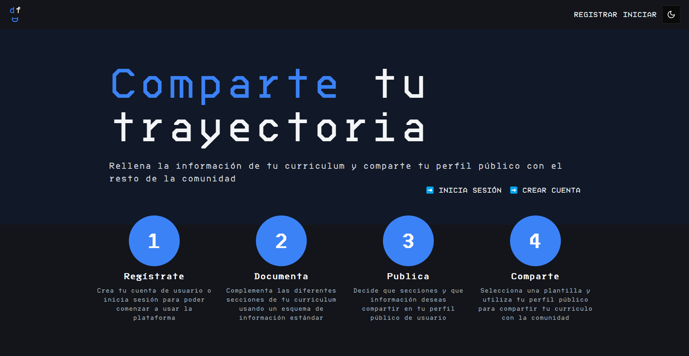

# dev profile for dev [Work in progress]
## Funcionalidad
Web que permite a los usuario logarse y crear una cuenta de desarrollador donde poder mantener aspectos relacionados con el desarrollo: 
 - Enlaces a recursos / tips / imágenes

## Detalles técnicos
- Web realizada en Astro y con algún componente React. Estilada con tailwindCSS. Typescript.
- Backend realizado con express y contra un postgresql. Typescript.
- Gestión de autentificación y autorización con jwt tokens
- Modelos de formularios (frontend) y base de datos (backend) validados con zod.
- Validación de esquemas zod con tipos genéricos (servicio de validación de esquemas)

# Capturas
## Gestión de usuarios

## Registro de CV por usuarios

## Formularios modales

## Modo claro y responsive

# Créditos
- [Motomangucode Font](https://www.fontspace.com/Motomang-font-f101909)  by Meyerfonts (Bryndan Meyerholt)
